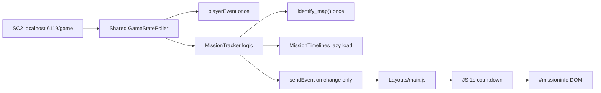

# Mission "What's Next" Overlay

## Goal

During an active co-op game, show **what happens next** on the overlay: the nearest upcoming **attack wave** or **mission-specific objective** (trains, void thrashers, evac ships, research vessels, etc.), with a live countdown.

**In scope (per your choice):** attack waves + mission objectives.
**Out of scope:** day/night phase labels, bonus-objective trigger text, commander tips, base analysis images.

**Data source:** [starcraft2coop.com/missions/](https://starcraft2coop.com/missions/) (CC-BY-NC-SA-4.0). The site exposes summary JSON (`/data/missions.json`) but **not** timing tables — those live in the 15 mission HTML guides. Timings must be extracted once and **bundled offline** in the overlay (no runtime scraping).

---

## Current Architecture (integration points)

The app already has the pieces needed for live mission identity and overlay messaging:


| Existing piece                                                                          | Role                                                                           |
| --------------------------------------------------------------------------------------- | ------------------------------------------------------------------------------ |
| `[SCOFunctions/IdentifyMap.py](SCOFunctions/IdentifyMap.py)`                            | Maps live SC2 player slots → canonical mission name (15 missions)              |
| `[SCOFunctions/MainFunctions.py](SCOFunctions/MainFunctions.py)` `check_for_new_game()` | Polls `http://localhost:6119/game`, reads `displayTime`, `isReplay`, `players` |
| `[SCOFunctions/MainFunctions.py](SCOFunctions/MainFunctions.py)` `sendEvent()`          | Pushes JSON to primary overlay (`runJavaScript`) + OBS WebSocket               |
| `[Layouts/main.js](Layouts/main.js)` + `[Layouts/Layout.html](Layouts/Layout.html)`     | Overlay DOM + event handlers (`playerEvent` pattern)                           |


**Gap:** `check_for_new_game()` only fires once at game start (for ally winrates) and stops tracking time. Mission countdowns need continuous `displayTime` tracking until the game ends — but this must **not** add a second high-frequency poller on top of the existing 0.5s loop.

**Important constraints discovered in the code (do not under-estimate these):**

- The poller is **started only once**, inside `mass_analysis_finished()` in `[SCO.py](SCO.py)` (~line 948), gated on `if SM.settings['show_player_winrates']`. So today it (a) does **not** start until the full mass replay analysis completes, and (b) cannot be started/stopped at runtime — toggling the setting requires an app restart. Any "shared poller" design inherits these facts.
- The existing loop is **tightly coupled to the replay-count heuristic** (`len(AllReplays) == last_replay_amount`) and a flat `time.sleep(0.5)`. Winrate detection deliberately waits for a new `.SC2Replay` and skips for 15s after parsing. Mission tracking must run on *every* poll, independent of replay count. This is therefore a **real refactor of winrate-critical code**, not a light "add-on" — treat winrate regression as a risk and test it.




---

## Performance Requirements

**Hard rule:** this feature must have **near-zero cost when disabled** and **no perceptible impact on SC2 or the overlay app when enabled**.

### 1. One poller, not two

Do **not** add a separate 1s polling thread. Refactor into a single shared poller (extract `GameStatePoller` from `[check_for_new_game()](SCOFunctions/MainFunctions.py)`) that:

- Reuses the existing `requests.Session` (already used for `:6119/game`)
- Fetches the `/game` response **once per tick**, then fans it out to **two independent gating paths**: winrate detection (replay-count heuristic, unchanged) and mission tracking (runs every tick, ignores replay count). Do not let mission tracking inherit the winrate `continue` guards.
- Starts at app launch when **at least one** live-game feature is enabled (`show_player_winrates` **or** `show_mission_timeline`); re-reads `SM.settings` live inside the loop for per-feature gating.

**Lifecycle / restart:** because the thread is created once (today in `mass_analysis_finished`), enabling either feature from a fully-off state still requires an **app restart** — this matches current winrate behavior. Document this in the setting tooltip. (Decoupling mission-tracker startup from `mass_analysis_finished` so it doesn't wait on mass analysis is recommended if cheap; otherwise document that mission tracking begins only after analysis init.) When both features are off at startup, the poller is not started at all.

### 2. Adaptive poll intervals


| State                                | Poll interval | Rationale                                                            |
| ------------------------------------ | ------------- | -------------------------------------------------------------------- |
| SC2 not running / connection refused | 10s           | Avoid hammering a dead port                                          |
| SC2 in menus (`displayTime == 0`)    | 3s            | Detect game start without busy-wait                                  |
| In active co-op game                 | 5–10s         | Only needed to sync clock + detect game end; not for countdown ticks |


The existing loop currently runs a **flat `time.sleep(0.5)`** with **`timeout=6`** on the request. Moving to the tiers above is a deliberate behavior change to winrate detection too (slightly higher game-start detection latency at the 3s menu tier) — confirm winrate still triggers reliably after the change. Target **≤1 request per 5s in-game**.

Lower the request `timeout` to ~2s (from the current 6s) on idle/menu polls to avoid thread pile-up.

### 3. Python sends events; JS owns the countdown

**Python → overlay traffic (minimal):**


| Event               | When sent                                                                      | Payload size                           |
| ------------------- | ------------------------------------------------------------------------------ | -------------------------------------- |
| `missionStartEvent` | Once per game, map identified                                                  | Map name + sorted event list (~1–2 KB) |
| `missionTimeEvent`  | Only when `displayTime` changes vs last sync, or every 10s as drift correction | `{displayTime}` only (~20 bytes)       |
| `missionEndEvent`   | Once when game ends                                                            | Empty                                  |


**Never** send per-second updates from Python. The overlay runs a local `setInterval(1000)` (or `requestAnimationFrame` throttled to 1 Hz) to decrement the countdown between syncs.

**Game-speed caveat:** `displayTime` advances at SC2 *game speed* ("Faster" for co-op), not wall-clock seconds, so a naive 1 Hz wall-clock tick will drift from the in-game clock. The periodic `missionTimeEvent` resync corrects this — keep the drift-correction sync interval tight (≤10s) and reconcile on every sync. (Optionally scale the JS tick to the observed `displayTime` delta between syncs.)

Pause handling: when synced `displayTime` stops changing across two polls, JS stops the local timer until the next sync resumes advancement.

### 4. Overlay DOM: update only on change

In `main.js`:

- Cache last rendered strings for `#missionnext` / `#missionupcoming`
- Rewrite DOM **only** when the displayed countdown or next-event label actually changes (typically once per second for countdown, less often for event transitions)
- No Chart.js, no layout reflows, no CSS transitions on every tick

### 5. Lightweight data access

- Bundle timelines as a **Python dict** in `[SC2Dictionaries/__init__.py](SCOFunctions/SC2Dictionaries/__init__.py)` (same pattern as `bonus_objectives`) — loaded once at import, no runtime file I/O
- On game start, pass **only the identified mission's** event list to JS (not all 15 missions)
- Events pre-sorted by `time` at build time; use binary search or a single index pointer for "next event" — lists are ~15–30 items so cost is trivial, but avoid rescanning on every poll

### 6. `sendEvent` / `runJavaScript` discipline

`runJavaScript` crosses the Python↔Qt WebEngine boundary and is relatively expensive. Rules:

- Do not call it on every poll tick
- Do not JSON-serialize the full timeline more than once per game
- Batch: if both winrate and mission events fire at game start, that is acceptable (2 calls); do not add a third redundant call

WebSocket path (OBS): same rate limits — append to `OverlayMessages` only on the events above, not continuously.

### 7. Zero-cost when disabled

- `show_mission_timeline: False` → no mission logic runs, no extra JS timers, panel stays hidden
- No background preload of mission HTML or network requests
- No changes to replay parsing hot path (`[check_replays()](SCOFunctions/MainFunctions.py)`)

### 8. Performance verification (acceptance criteria)

Before shipping:

- Confirm poller thread CPU ~0% at idle (Task Manager, 5 min with SC2 closed)
- Confirm ≤1 `:6119/game` request per 5s during an active mission
- Confirm `runJavaScript` called ≤3 times in the first 60s of a game (start + 1–2 time syncs), then ≤1 per 10s thereafter
- Play a full co-op game with overlay enabled; no frame stutter attributable to overlay (subjective + log timestamps)

---

## Data Layer

### New bundled file

**Decision: bundle as a Python dict**, not JSON. The existing `[SC2Dictionaries/__init__.py](SCOFunctions/SC2Dictionaries/__init__.py)` inlines large dicts directly (`bonus_objectives`, `amon_player_ids`, `UnitCompDict`, …) and exposes them on import with no runtime file I/O. Add a new `MissionTimelines.py` module (or an inline dict) and re-export it from `__init__.py` for the same zero-I/O, import-once behavior. (If JSON is strongly preferred for editability, it must be loaded via `get_file_path` like the CSV/txt assets — but the dict approach is more idiomatic here. Don't leave both options open during implementation.)

**Data freshness:** include a `version`/`patch` stamp and a `source_date` field at the top of the file. Bundled Brutal timings can silently desync after balance patches or for randomized patterns; the stamp makes staleness auditable.

**Event schema** (seconds from mission start, Brutal difficulty):

```json
{
  "Void Thrashing": {
    "events": [
      {"time": 180, "kind": "attack_wave", "label": "Attack wave", "tech": 1, "strength": 1, "spawn": "Right", "pattern": "A"},
      {"time": 270, "kind": "objective", "label": "Void Thrasher set 1"},
      {"time": 560, "kind": "objective", "label": "Void Thrasher set 2"}
    ]
  }
}
```

**Fields:**

- `time` — seconds (convert `4:30` → 270)
- `kind` — `"attack_wave"` | `"objective"`
- `label` — user-facing text
- Optional: `tech`, `strength`, `spawn`/`direction`, `rail`, `set`, `pattern` (for A/B splits)

**Name normalization:** starcraft2coop uses `"Lock and Load"`; SCO uses `"Lock & Load"`. Keys in the timeline file must use **SCO canonical names** from `IdentifyMap.py`.

### Extraction workflow (dev-only)

Add a small script under `[Development/](Development/)` (e.g. `extract_mission_timings.py`) to help populate JSON from the 15 HTML pages. First pass can be semi-manual (copy tables from guides); script validates sorting, duplicate times, and name coverage.

### Per-mission content to capture


| Mission          | Attack waves                                     | Mission objectives                                                 |
| ---------------- | ------------------------------------------------ | ------------------------------------------------------------------ |
| Void Thrashing   | Pattern A + B tables                             | 4 thrasher set times (4:30, 9:20, 13:40, 18:00)                    |
| Dead of Night    | End-of-night waves (computed: night ends − 1:00) | Skip day/night labels; still emit attack-wave events               |
| Oblivion Express | 9 attack waves                                   | 10 train spawns + 2 bonus trains (bonus trains excluded per scope) |
| Miner Evacuation | Standard waves                                   | Evac ship timings                                                  |
| Void Launch      | Standard waves                                   | Research vessel / platform events                                  |
| Scythe of Amon   | Standard waves                                   | Warp prism / bonus timing events (bonus text excluded)             |
| …                | Remaining 9 missions                             | Each mission's objective table from its guide                      |


**Random/unknown patterns** (e.g. Void Thrashing A vs B): when pattern is unknown, show **both** as separate “possible next” lines until the first wave time resolves the pattern, then lock to the matching set for the rest of the game.

---

## Backend: Live Mission Tracker

### Step 0 (do this first): refactor `check_for_new_game()` into a shared poller

This is the **highest-risk change** in the feature because it rewrites the internals of a working, timing-sensitive winrate detector. Failure mode is **silent winrate regressions** (duplicate/early/missing winrate popups), not crashes — so do it carefully and verify winrate behavior afterward.

**Why it's risky (from the current code):**

- Winrate is gated on **replay-file state**, not game state: `if len(player_winrate_data) == 0 or len(AllReplays) == last_replay_amount: continue` runs before anything else. Mission tracking must **not** sit behind this guard.
- Four interlocked state vars (`last_game_time`, `last_replay_amount`, `last_replay_amount_flowing`, `last_replay_time`) plus a 15s false-positive suppression window exist because the localhost API briefly reports the *previous* game after a new replay lands. Reordering the loop can reintroduce duplicate popups.
- One flat `time.sleep(0.5)` cadence serves a "detect-once" feature; mission tracking needs "track-continuously" + adaptive idle tiers.

**Target structure — fetch once at the top, then fan out to two paths that each own their guards/state.** Keep the existing winrate code as-is inside `winrate_path()`; do not change its logic, only relocate it.

```python
def game_state_poller(progress_callback):
    time.sleep(4)  # keep: wait for replay init (unchanged)
    winrate_state = WinrateState()      # wraps the 4 existing vars + last_game_time
    tracker = MissionTracker()          # pure-logic, owns its own in_game/last_sync state

    while True:
        if APP_CLOSING:
            break

        # --- single shared fetch ---
        resp = None
        try:
            timeout = 2 if tracker.idle else 5   # short timeout when idle
            resp = session.get('http://localhost:6119/game', timeout=timeout).json()
        except requests.exceptions.ConnectionError:
            tracker.on_disconnect()              # -> may emit missionEndEvent
        except (json.decoder.JSONDecodeError, requests.exceptions.ReadTimeout):
            pass
        except Exception:
            logger.info(traceback.format_exc())

        # --- fan out (each path applies ITS OWN gating; no shared continues) ---
        if resp is not None:
            if SM.settings['show_player_winrates']:
                winrate_path(resp, winrate_state, progress_callback)   # existing logic, relocated verbatim
            if SM.settings['show_mission_timeline']:
                tracker.update(resp)                                   # mission path, replay-independent

        # --- adaptive sleep (replaces flat 0.5s) ---
        time.sleep(poll_interval(resp, tracker))   # 10s disconnected / 3s menus / 5s in-game
```

**Rules for the refactor:**

- `winrate_path()` must contain the **exact** current guards (replay-count skip, 15s suppression, `displayTime` change check, `all_users`/`len(players) <= 2`/`isReplay` skips). Move it, don't rewrite it.
- The mission path reads the **same `resp`** but must never be gated by `player_winrate_data` or `AllReplays` length.
- Settings are re-read **inside the loop** each tick so a feature can be effectively on/off without a guard living at thread-start (the thread-start gate still decides whether the poller exists at all — see restart caveat below).
- If only one feature is enabled, the other path is simply skipped; the shared fetch + adaptive sleep still apply.

> Acceptance for this step specifically: with `show_mission_timeline: False`, winrate popups behave **identically** to today (same timing, no duplicates) across at least one new game + one replay-parse event.

### New module: `[SCOFunctions/MissionTracker.py](SCOFunctions/MissionTracker.py)`

Pure logic module (**no own thread** — keep this consistent everywhere; the mermaid diagram and phase list call it a "tracker," but it owns no thread). Called from the **shared game-state poller** after each `:6119/game` response.

**State machine:** `idle` → `in_game` → `idle`

**On each poll result:**

1. **In-game check:** `not isReplay`, `len(players) > 2`, not all `type == 'user'`, `displayTime > 0`
2. **Game start (once):** call `identify_map(players)`; look up pre-sorted timeline; send `missionStartEvent`
3. **In-game sync:** send `missionTimeEvent` **only if** `displayTime` changed since last sent, or ≥10s since last sync (whichever comes first)
4. **Game end:** send `missionEndEvent` and reset state on any of: connection lost, `isReplay` becomes true, player list changes/empties, or a "game over" heuristic. **Do not rely on `displayTime == 0` alone** — after a match ends you sit on the **score screen**, where `/game` typically still returns the *final non-zero* `displayTime` and the same players, so a `displayTime == 0` check would leave the panel lingering. Detect post-game via `displayTime` no longer advancing across several polls (combined with the score-screen state) and hide then.

**Independent of replay parsing** — mission tracking must not wait for a new `.SC2Replay` file (unlike winrate detection). The shared poller runs when either feature is enabled; each feature applies its own gating on the same response.

### Extend `sendEvent()` in `[MainFunctions.py](SCOFunctions/MainFunctions.py)`

Add handlers for three new event types (mirror existing `playerEvent` pattern). **Serialize with `json.dumps` first**, exactly like the existing handlers (`data = json.dumps(event)`), then pass `data` into the JS call — do not pass a raw dict:

```python
elif event.get('missionStartEvent') is not None:
    data = json.dumps(event)
    WEBPAGE.runJavaScript(f"missionStart({data});")
elif event.get('missionTimeEvent') is not None:
    data = json.dumps(event)
    WEBPAGE.runJavaScript(f"missionSyncTime({data});")
elif event.get('missionEndEvent') is not None:
    WEBPAGE.runJavaScript("missionEnd();")
```

Also handle these in the WebSocket `onmessage` branch of `[Layouts/main.js](Layouts/main.js)` `connect_to_socket()` (the `data['...Event'] != null` chain), alongside `playerEvent`.

### Wire up in `[SCO.py](SCO.py)`

- New setting `show_mission_timeline` (default `True`)
- Change the poller start condition in `mass_analysis_finished()` (~line 948) from `if SM.settings['show_player_winrates']:` to start when `show_player_winrates` **or** `show_mission_timeline` is enabled (one thread, not two). Keep the `progress.connect(self.map_identified)` wiring.
- **Restart caveat:** the thread is created once here (and only after mass analysis completes), so enabling either feature from fully-off requires an app restart — same as winrate today. State this in the tooltip rather than promising live toggling. If decoupling mission-tracker startup from `mass_analysis_finished` is cheap, prefer it so mission tracking doesn't wait on analysis; otherwise accept/document the delay.

---

## Frontend: Overlay Panel

### HTML — `[Layouts/Layout.html](Layouts/Layout.html)`

Add a persistent in-game panel (separate from post-game `#stats`):

```html
<div id="missioninfo">
  <div id="missionname"></div>
  <div id="missionnext"></div>
  <div id="missionupcoming"></div>
</div>
```

### CSS — `[Layouts/main.css](Layouts/main.css)`

Style similar to `[#playerstats](Layouts/main.css)` but **always visible during game** (e.g. top-left, semi-transparent background). Hidden by default; shown on `missionStart`, hidden on `missionEnd`.

### JS — `[Layouts/main.js](Layouts/main.js)`

New functions:

- `missionStart(data)` — store timeline, show panel, start **local 1s interval** for countdown display
- `missionSyncTime(data)` — reconcile `displayTime` from SC2 (handles pause/drift); does **not** re-render unless drift exceeds 1s
- `missionEnd()` — clear interval, hide panel, drop stored timeline (free memory)
- `getUpcomingEvents(gameTime, events, limit=3)` — pure function: filter future events, handle pattern A/B ambiguity, format countdown (`MM:SS`)
- `renderMissionPanel()` — compare against cached strings; skip DOM writes when unchanged

**Display format (example):**

```
Void Thrashing
NEXT: Attack wave — 1:24 (Tech 3 / Str 3, Left)
THEN: Void Thrasher set 3 — 4:02
```

Use existing overlay color variables (`gP1Color`, etc.) for consistency.

---

## Settings UI

In `[SCOFunctions/Settings.py](SCOFunctions/Settings.py)`:

```python
'show_mission_timeline': True,
```

In `[SCOFunctions/Tabs/MainTab.py](SCOFunctions/Tabs/MainTab.py)`: checkbox **"Show mission timeline"** with tooltip noting Brutal timings and [starcraft2coop.com](https://starcraft2coop.com/missions/) attribution.

Wire load/save in `[SCO.py](SCO.py)` (same pattern as `CH_FastExpand` / `CH_ShowPlayerWinrates`).

Optional sub-settings (phase 2): number of upcoming events shown (1–3), panel position.

---

## Edge Cases


| Case                            | Behavior                                                              |
| ------------------------------- | --------------------------------------------------------------------- |
| Map not identified (custom map) | Hide panel; log debug                                                 |
| SC2 not running                 | Stay idle, no errors                                                  |
| Score screen / post-game        | `/game` still returns final non-zero `displayTime` + same players → detect via clock no longer advancing; hide panel (do NOT rely on `displayTime == 0`) |
| Game paused                     | `displayTime` stops advancing — sync from API prevents drift          |
| Void Thrashing pattern unknown  | Show both pattern options until first wave resolves                   |
| Dead of Night                   | Emit attack-wave events at computed times; no “Night 2 starts” text   |
| Difficulty not Brutal           | Show timings anyway with small “Brutal timings” note in tooltip/panel |
| OBS secondary overlay           | Works via WebSocket + same JS handlers                                |


---

## Implementation Phases

### Phase 1 — Foundation (2–3 pilot missions)

- Data schema + dict loader
- Shared poller refactor (fan-out to winrate + mission paths) + `MissionTracker` pure-logic module + `sendEvent` wiring
- Overlay panel + countdown logic
- Pilot missions with distinct event types: **Void Thrashing**, **Oblivion Express**, **Dead of Night**

### Phase 2 — Full mission coverage

- Populate remaining 12 missions from starcraft2coop guides
- Extraction/validation script
- Pattern-disambiguation logic (Void Thrashing, any other split-pattern missions)

### Phase 3 — Polish

- Settings checkbox + attribution line
- Tune panel layout/position
- Manual in-game testing on each mission

---

## Testing Plan

1. Enable setting; start SC2 co-op on a pilot mission
2. Verify panel appears within ~1s of game clock starting
3. Confirm countdown matches in-game clock (compare to pause/unpause)
4. Verify next event updates after each timed event passes
5. Confirm panel hides on mission end / return to menu
6. Test OBS browser source receives same updates via WebSocket
7. **Winrate regression (Step 0):** with `show_mission_timeline: False`, confirm winrate popups behave identically to pre-refactor — fire once per new game, no duplicates, correct 15s post-replay suppression, correct ally identification. Test across one new game **and** one replay-parse event.
8. **Performance:** with setting off, confirm no `:6119` requests beyond existing winrate poller; with setting on, log request count over 10 min in-game (target ≤120 requests)
9. **Performance:** confirm JS interval is cleared on `missionEnd` (no leaked timers)

---

## Attribution

Add a one-line credit in the setting tooltip and/or overlay footer: timing data from [starcraft2coop.com](https://starcraft2coop.com/missions/) (CC-BY-NC-SA-4.0, Aommaster).

**ShareAlike obligation:** CC-BY-NC-SA-4.0 includes a *ShareAlike* clause, so the bundled timing data (and any derivative data file) must carry the same license, not just an attribution string. Add a short license/attribution header in the `MissionTimelines.py` data file itself (source, author, license, `source_date`), in addition to the UI tooltip. NC is fine for this non-commercial app.
